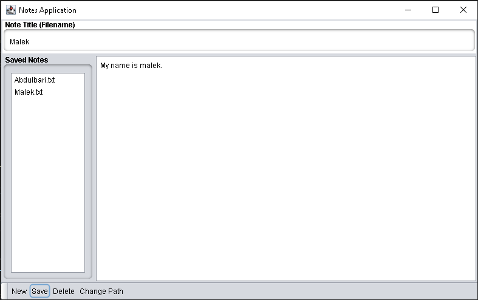

# Notes Application

A simple Notes App made with Java Swing that lets users create, save, edit, and delete notes. The notes are saved as .txt files in a folder chosen by the user, and the app makes it easy to access them.

## 🌟 Key Features

- **Simple Note Creation**: Create notes with a title and content easily.
- **Save Notes**: Save your notes as `.txt` files in a chosen directory.
- **View/Edit Saved Notes**: View and edit any previously saved notes.
- **Delete Notes**: Remove unwanted notes with a simple click.
- **Change Save Directory**: Choose or change the folder path where the notes are saved.
- **User-Friendly Interface**: The application uses a clean, organized GUI for a smooth user experience.
- **Immediate File Access**: Notes are instantly saved and accessed from the directory.

---

## 💻 Installation Guide

Follow these steps to set up and run the Notes Application:

### Prerequisites

- **Java Development Kit (JDK) 8 or higher** should be installed on your machine.
  - [Download JDK](https://www.oracle.com/java/technologies/javase-downloads.html) if you don't have it installed.
- **integrated development environment (IDE)** It is recommended to use visual studio code **(VSCode)**

### Steps to Install

1. **Clone or Download the Repository**:
   - Clone the repository to your local machine using:
     ```bash
     git clone https://github.com/MalekAlharbi/MyNote.git
     ```
   - Or, download the project as a ZIP file and extract it.

2. **Compile the Program**:
   - Navigate to the project directory and run:
     ```bash
     javac NotesApp.java
     ```

3. **Run the Application**:
   - After compilation, execute the program using:
     ```bash
     java NotesApp
     ```

---

## 📖 User Guide

### Initial Setup: Choosing Save Directory

- Upon launching the application for the first time, you will be prompted to select a folder path where all your notes will be stored. You can choose any directory on your computer.

### Main Functions:

1. **Create a New Note**:
   - Enter a title in the "Note Title (Filename)" field.
   - Write your note content in the large text area.
   - Click **Save** to store the note in the selected folder.

2. **View Existing Notes**:
   - On the left side of the window, you will see a list of all saved notes.
   - Click on any note to load it into the text area for viewing or editing.

3. **Edit and Save Changes**:
   - Modify the note content and click **Save** again to update the file.

4. **Delete a Note**:
   - Select a note from the list on the left, then click **Delete** to remove it from the application and the directory.

5. **Change Save Path**:
   - Use the **Change Path** button to select a new directory where the notes will be saved.

---

## 🛠️ Troubleshooting

### Common Issues and Solutions:

1. **Java Version Compatibility**:
   - Ensure that you are using JDK 8 or higher. Running the program with older versions of Java may cause errors.

2. **Error: NullPointerException when choosing a save path**:
   - This may occur if the file chooser is not properly initialized. Restart the program and try again.
   - Ensure the correct path is selected when prompted to choose a save directory.

3. **Error: Unable to Save Notes**:
   - If the program cannot save your notes, check if the save directory exists.
   - If the directory is deleted or moved, you will receive an error. Choose a new valid path using the **Change Path** button.

4. **File Not Found Exception**:
   - This occurs when the program tries to load a note from a path that no longer exists. Ensure the path where the notes are saved remains valid.

5. **Unable to Launch the Application**:
   - Make sure Java is correctly installed and set in your system’s environment variables.
   - Run `java -version` in your command prompt or terminal to verify Java is installed.

---

## ❓ Frequently Asked Questions (FAQ)

### How are notes saved?
- Notes are saved as plain text files (`.txt`) in the directory you select upon first running the application. You can change this directory anytime using the **Change Path** button.

### What happens if I delete the notes directory?
- If you delete or move the directory containing your notes, the application will prompt you to select a new path. Until a valid path is selected, you won’t be able to save new notes.

### Can I view my notes outside the app?
- Yes! All notes are saved as `.txt` files. You can open and edit these files using any text editor on your system.

---

## 📚 Footnotes
- Nimbus Look and Feel: The app uses the Nimbus theme to provide a modern interface.
- Java Swing: The core GUI framework used for this application.
- File-based Configuration: Configs and notes are saved locally without requiring external databases.

## 🖼️ Image


